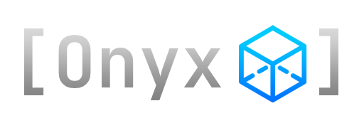

# 
Onyx is a high-level C++ library for rendering graphics to the screen using OpenGL 4.1 and GLFW 3.4.  

The intuitive and well-structured codebase makes it simpler than ever to code games, apps, or any graphical interface using a language as complex as C++.  

## Download
Onyx can be downloaded as pre-compiled binaries for Windows Visual Studio x64, or the source files themselves.  
Everything needed is included in the following links (from a release page, download the onyx-x.x.x.zip file under assets).

[Latest Release (1.1.0)](https://github.com/jopo86/onyx/releases/tag/v1.1.0)  
[All Releases](https://github.com/jopo86/onyx/releases)  

## Get Started
I'm always lost when trying to learn a library by reading it's massive documentation. So, I've created two tutorials: the [Basic Tutorial](https://github.com/jopo86/onyx/wiki/Basic-Tutorial) and the [Advanced Tutorial](https://github.com/jopo86/onyx/wiki/Advanced-Tutorial). I recommend you go through at least the basic tutorial before using the documentation.  

There is also a [Guides](https://github.com/jopo86/onyx/wiki/guides) page, with helpful guides on how to use different classes throughout the library. But, if, for whatever reason, you want boring old documentation, it can be found in the code headers themselves.  

## Features (Natively Supported)
- Creating/Customizing Windows
- Input Handling
- Can Render:
  - Hardcoded meshes
  - Loaded models (OBJ format)
  - Lighting (Ambient & Directional)
  - GUI and Text
  - Colors and/or Textures
- Camera (movement in 2D or 3D world)
- Transforms (position, rotation, scale) for Renderables and the Camera
- Presets for Meshes, Shaders, and Renderables
- Extensive Matrix & Vector Math
