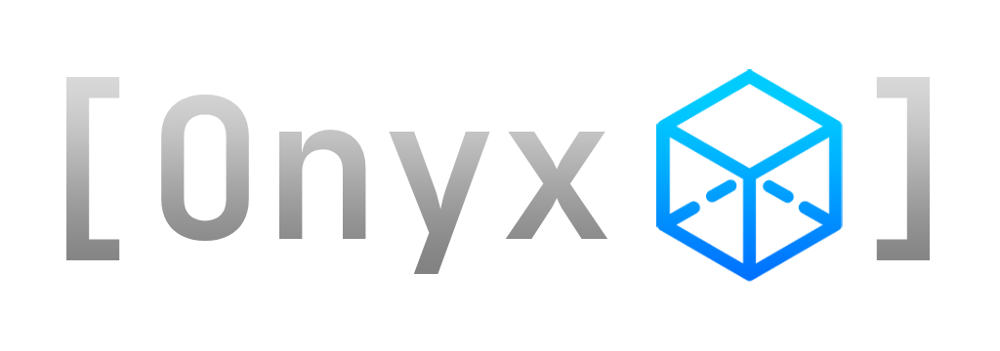

# 
Onyx is a high-level C++ library for rendering graphics to the screen using OpenGL 4.1.  

The intuitive and well-structured codebase makes it simpler than ever to code games, apps, or any graphical interface using a language as complex as C++.  

## Download
Onyx can be downloaded as pre-compiled binaries for x64, or the source files themselves.  
Everything needed is included in the following links.

[Latest Release - available soon](#)  
[All Releases - available soon](#)  

## Get Started
Tutorial and documentation coming soon!
