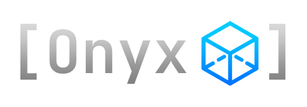

# 
Onyx is a high-level, cross-platform C++ rendering engine using OpenGL 4.1, with additional functionalities including window and input handling using GLFW.  

The intuitive and well-structured codebase makes it simpler than ever to code games, apps, or any graphical interface using a language as complex as C++.  

Feel free to email jopo86dev@gmail.com with any questions!  

## Download
There are pre-compiled binaries for Windows MinGW64 and Linux, but they are not guaranteed to work, so if they don't for you, you can compile yourself using CMake. See [Build](https://github.com/jopo86/onyx/wiki/Build) for detailed download/build instructions.  

[Latest Release (1.7.0)](https://github.com/jopo86/onyx/releases/tag/v1.7.0)  
[All Releases](https://github.com/jopo86/onyx/releases)  

## Get Started
I'm always lost when trying to learn a library by reading it's massive documentation. So, I've created two tutorials: the [Basic Tutorial](https://github.com/jopo86/onyx/wiki/Basic-Tutorial) and the [Advanced Tutorial](https://github.com/jopo86/onyx/wiki/Advanced-Tutorial). I recommend you go through at least the basic tutorial before using the documentation.  

There is also a [Guides](https://github.com/jopo86/onyx/wiki/guides) page, with helpful guides on how to use different classes throughout the library. But, if, for whatever reason, you want boring old documentation, it can be found in the code headers themselves.  

## Features (Natively Supported)
- Creating & Customizing Windows
- Input Handling (keyboard, mouse, controllers/gamepads)
- Rendering:
  - Hardcoded meshes
  - Loaded models (OBJ format)
  - GUI and Text
  - Lighting (Ambient & Directional), Fog
  - Colors and/or Textures
- Camera (movement in 2D or 3D world)
- Transforms (position, rotation, scale) for Renderables and the Camera
- Presets for Meshes, Shaders, and Renderables
- Monitor info
- Extensive Matrix & Vector Math
- Thread-safety (except functions that use OpenGL)
- Various system functions (clipboard access, modifier key states, and more)
