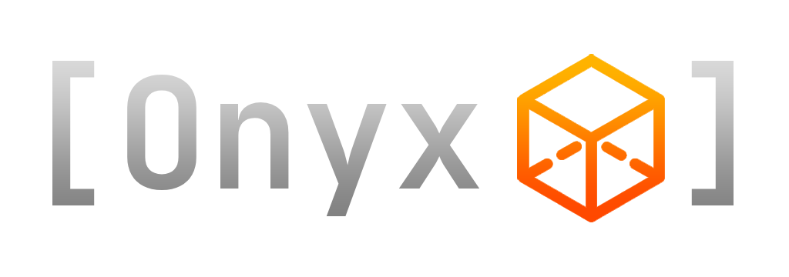

# 
Onyx is a high-level C++ library for rendering graphics to the screen using OpenGL 4.1.  

The intuitive and well-structured codebase makes it simpler than ever to code games, apps, or any graphical interface using a language as complex as C++.  

## Download
Onyx can be downloaded as pre-compiled binaries for Windows Visual Studio x64, or the source files themselves.  
Everything needed is included in the following links (from a release page, download the onyx-x.x.x.zip file under assets).

[Latest Release (0.6.1-beta)](https://github.com/jopo86/onyx/releases/tag/v0.6.1-beta)  
[All Releases](https://github.com/jopo86/onyx/releases)  

## Get Started
Get started with the [Basic Tutorial](https://github.com/jopo86/onyx/wiki/Basic-Tutorial).  
Full documentation will come with the full release (1.0.0).  

## Stay Up-To-Date
Stay up to date with these helpful Trello boards:  
[Patch Notes](https://trello.com/b/YD9vXG4P/patch-notes)  
[Bugs](https://trello.com/b/Ro62dQpE/bugs)  
